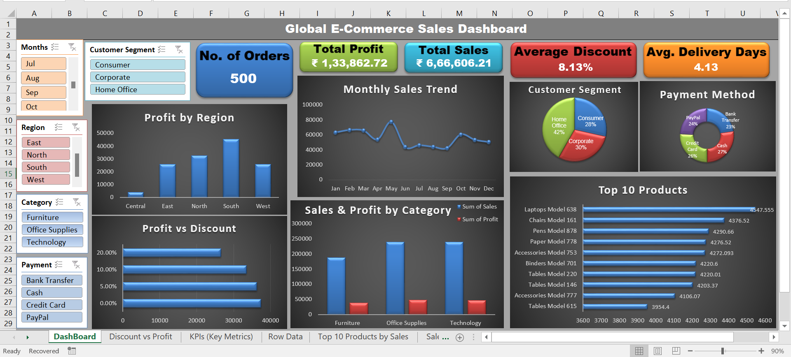

# 📊 Global E-Commerce Sales Dashboard

### A pivot-table-based Excel dashboard project for interactive sales analysis

An interactive **Excel Dashboard** built for analyzing **global e-commerce sales performance** with key business metrics, visualizations, and filters.  
This project is ideal for showcasing **data analysis, Excel pivot tables, and dashboard design skills**.

---

## 🚀 Features

### **1. KPI Cards**

- **No. of Orders** – Track total orders placed
- **Total Profit & Total Sales** – Overall business performance
- **Average Discount %** – Measure promotional impact
- **Average Delivery Days** – Operational efficiency metric

### **2. Interactive Filters**

- **Slicers** for:
  - Month
  - Region
  - Category
  - Payment Method
  - Customer Segment

### **3. Visual Insights**

- **Monthly Sales Trend** – With smooth line & data markers
- **Profit by Region** – Regional performance breakdown
- **Sales & Profit by Category** – Product category performance
- **Profit vs. Discount** – Bar chart to compare profit levels across different discount ranges
- **Customer Segment Share** – Pie chart for segment distribution
- **Payment Method Share** – Donut chart for payment preferences
- **Top 10 Products by Sales** – Horizontal bar chart

---

## 🛠 Tools & Skills Used

- **Microsoft Excel**  
  - Pivot Tables  
  - Pivot Charts  
  - Slicers & Timelines  
  - Conditional Formatting  
  - Custom chart formatting

---

## 📂 Files in this Repository

- `Ecommerce_Raw_Data.xlsx` – Original dataset used for analysis
- `Global_Ecommerce_Dashboard.xlsx` – Final interactive Excel dashboard
- `dashboard_screenshot.png` – Dashboard preview image
- `README.md` – Project documentation

---

## 📸 Dashboard Preview

---

## 📈 How to Use
1. **Download** the `.xlsx` files from this repository.
2. Open `Global_Ecommerce_Dashboard.xlsx` in **Microsoft Excel** (2016 or later recommended).
3. Use the **slicers** to filter and explore the data interactively.
4. If you want to rebuild the dashboard yourself, start with `Ecommerce_Raw_Data.xlsx` and create Pivot Tables and Charts as demonstrated.

---

## 🎯 Purpose of the Project
This dashboard simulates a **real-world business scenario**, helping decision-makers quickly analyze:
- Which regions are most profitable
- How discounts impact profits
- Which customer segments and products drive sales

---

## 💼 Author

**Harsh Belekar**  
📧 harshbelekar74@gmail.com  
🔗 [LinkedIn Profile](https://www.linkedin.com/in/harshbelekar/)  
🔗 [GitHub Profile](https://github.com/Harsh-Belekar)

---

## 📢 Feedback
If you found this project useful, feel free to ⭐ the repository and connect on LinkedIn!
